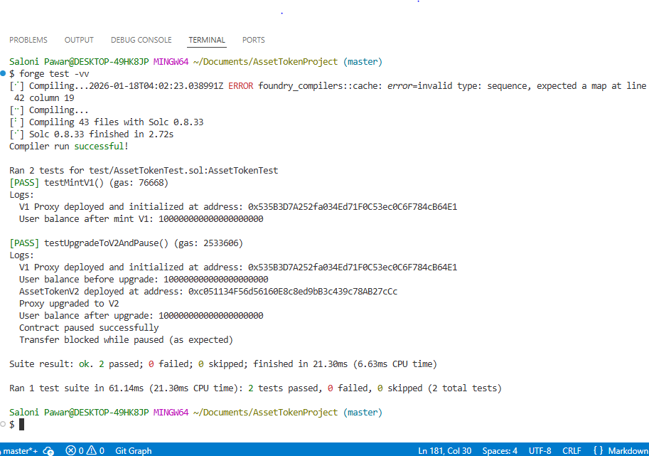

# Upgradeable Asset Token (UUPS)

## Xaults Coding Challenge Submission

**Challenge:** Upgradeable Asset Tokenizer
**Focus Areas:** UUPS Upgradeability • Storage Layout Safety • Smart Contract Security
**Tools:** Solidity • OpenZeppelin • Hardhat • Foundry

---

## 1. Objective

This project demonstrates the **design, implementation, testing, and upgrade lifecycle** of a **secure UUPS-upgradeable ERC20 asset token**, as required by the Xaults coding challenge.

The implementation emphasizes:

* Correct use of **UUPS (ERC1967) proxy pattern**
* **Storage layout safety** across upgrades
* Clear **role-based access control**
* Defensive programming and **security best practices**
* End-to-end lifecycle: deploy → upgrade → verify → test

---

## 2. Design Overview

### Upgradeability Pattern

* Uses **UUPS (Universal Upgradeable Proxy Standard)**
* Upgrade logic resides inside the implementation contract
* Proxy delegates calls via `ERC1967Proxy`
* Upgrade authorization enforced using `_authorizeUpgrade()`

### Roles & Permissions

| Role                 | Responsibility                       |
| -------------------- | ------------------------------------ |
| `DEFAULT_ADMIN_ROLE` | Upgrade authorization, pause/unpause |
| `MINTER_ROLE`        | Token minting                        |

---

## 3. Project Structure

```text
contracts/
├── AssetToken.sol        # V1: Capped ERC20 + UUPS
├── AssetTokenV2.sol      # V2: Pause / Unpause extension

test/
└── AssetTokenTest.sol    # Foundry tests (upgrade + storage safety)

scripts/
├── deploy.js             # Hardhat deployment (proxy)
└── upgrade.js            # Hardhat upgrade script
```

---

## 4. AssetToken V1 – Core Implementation

### Features

* ERC20-compliant asset token
* UUPS upgradeable
* Role-based access control
* **Hard capped total supply**

### Capped Supply Enforcement

```solidity
if (totalSupply() + amount > maximumTokens) {
    revert MaxSupplyExceeded();
}
```

**Rationale:**

* Prevents uncontrolled inflation
* Ensures predictable asset supply
* Suitable for financial tokenization use cases

### Upgrade Authorization

```solidity
function _authorizeUpgrade(address)
    internal
    override
    onlyRole(DEFAULT_ADMIN_ROLE)
{}
```

Only the admin can authorize upgrades, preventing malicious implementation changes.

---

## 5. AssetToken V2 – Upgrade Extension

### Added Functionality

* `pause()` / `unpause()` controls
* All transfers blocked while paused
* Admin-restricted execution

### Safe Upgrade Strategy

* Uses `reinitializer(2)`
* **No state variables removed or reordered**
* New variables appended only

This guarantees **storage layout compatibility** with V1.

---

## 6. Deployment & Upgrade Flow (Hardhat)

### Deploy V1 Proxy

```bash
npx hardhat run scripts/deploy.js --network localhost
```

* Deploys V1 implementation
* Deploys ERC1967 proxy
* Initializes via UUPS

### Upgrade to V2

```bash
npx hardhat run scripts/upgrade.js --network localhost
```

* Deploys V2 implementation
* Upgrades proxy safely
* Executes `initializeV2()`

---

## 7. Testing Strategy (Foundry)

```bash
forge test -vv
```

### Tests Cover

* Minting logic and cap enforcement
* Upgrade execution via proxy
* Storage layout preservation
* Balance persistence across upgrades
* Pause/unpause behavior
* Transfer reversion while paused

Balance verification before and after upgrade confirms **storage safety**.

---

## 8. Storage Layout Safety Verification

Storage safety was validated using:

* Strict variable ordering discipline
* OpenZeppelin upgradeable base contracts
* `reinitializer(2)` for V2 logic
* Runtime verification via Foundry tests

**Result:** Token balances remain intact after upgrade, proving safe layout.

---

## 9. Security Considerations

* Admin-only upgrade authorization
* Restricted minting access
* Pausing for emergency control
* Explicit revert on supply violation
* Uses audited OpenZeppelin contracts

---

## 10. CLI Execution Evidence

### Run Tests

```bash
forge test -vv
```



---

## 11. Conclusion

This implementation satisfies all Xaults challenge requirements by demonstrating a **secure, upgradeable asset token**, with clear upgrade controls, verified storage safety, and full lifecycle testing using modern Ethereum tooling.

---


